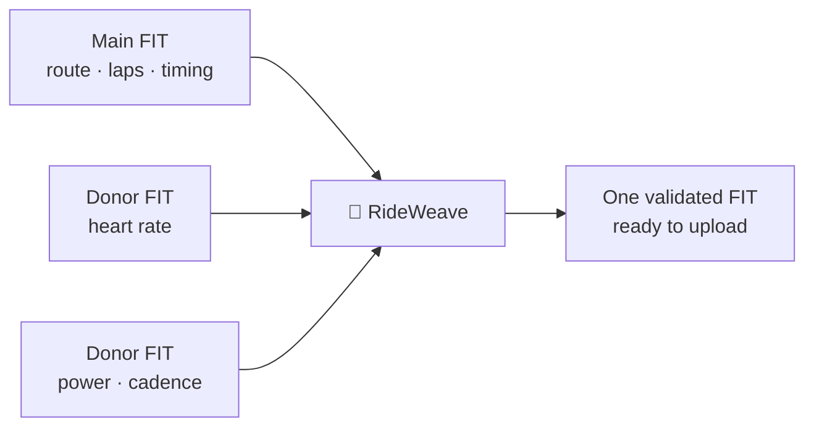

# 🚴 RideWeave

**One ride. Every sensor. One FIT file.**

🌐 **[Try RideWeave in your browser](https://junyanghe.github.io/rideweave/)**

RideWeave is a free, open-source FIT merger for cyclists. Choose one recording as your main ride, add selected sensor data from up to three other recordings, and download one validated FIT file ready to upload to Strava.

Everything happens locally in your browser. Your ride files are never uploaded to a server.

## The problem

You finish one ride, but your data is split across several recordings:

- one has the best route, speed, distance, laps, and pauses;
- another has heart rate;
- another may have power or cadence.

Some sensors do not sync with Strava. Others do sync, but arrive as separate activities. Instead of one complete ride, you get several partial copies.

RideWeave brings those recordings together without requiring a new, expensive bike computer.



## How it works

1. Add **2–4 FIT files** from the same ride.
2. Choose exactly one as the **main activity**.
3. Pick one authoritative source for each field you want to add.
4. Review timestamp alignment and coverage.
5. Merge and download the finished FIT file.

The main activity remains the foundation. RideWeave preserves its timeline, route, laps, pauses, events, and activity structure by default. Donor recordings contribute only the fields you select.

Recordings are matched using their real FIT timestamps. RideWeave does not shift start times, average conflicting sensors, or silently replace base fields.

## 🔒 Private by design

FIT files can reveal where you live, when you ride, and detailed health or performance data. RideWeave therefore runs entirely on your device:

- no file uploads;
- no backend or database;
- no account;
- no saved ride history.

The website serves static application files. Parsing and merging run in a Web Worker inside your browser, and the result is checked for valid FIT structure and CRC before download.

## What the POC supports

- Two to four FIT files from one cycling activity.
- Required main-activity selection.
- Heart-rate, power, and cadence donors.
- Field discovery and recommended source mapping.
- Field-specific timestamp tolerances.
- Alignment and coverage preview.
- FIT structure and CRC validation.
- Browser-only processing with no environment variables or server code.

Donor data must come from a source that can export a compatible FIT file. RideWeave does not connect directly to recording services or recover data from platforms that do not provide an export.

RideWeave is an early proof of concept. Keep your original files and verify the merged activity before deleting or replacing anything.

## Local development

You need Node.js 20.19+ or 22.12+, npm, Git, and a current browser.

```bash
npm install
npm run dev
```

Run the complete quality check with:

```bash
npm run typecheck
npm run lint
npm test
npm run build
```

Never commit personal ride files. Private developer samples belong under `tests/private/`, which is ignored by Git. Public test fixtures must be synthetic or explicitly licensed for redistribution.

## Deployment

GitHub Actions checks every push to `main` and automatically publishes the latest successful build to [RideWeave on GitUb Pages](https://junyanghe.github.io/rideweave/).

The same static project can also be hosted on Vercel with `npm run build`, the `dist` output directory, and no environment variables.

## Contributing

Bug reports, interoperability testing, synthetic fixtures, and accessibility improvements are welcome. Please do not attach personal FIT files to public issues.

## License

[MIT](./LICENSE). The FIT protocol and third-party runtime assets remain subject to their respective terms.
